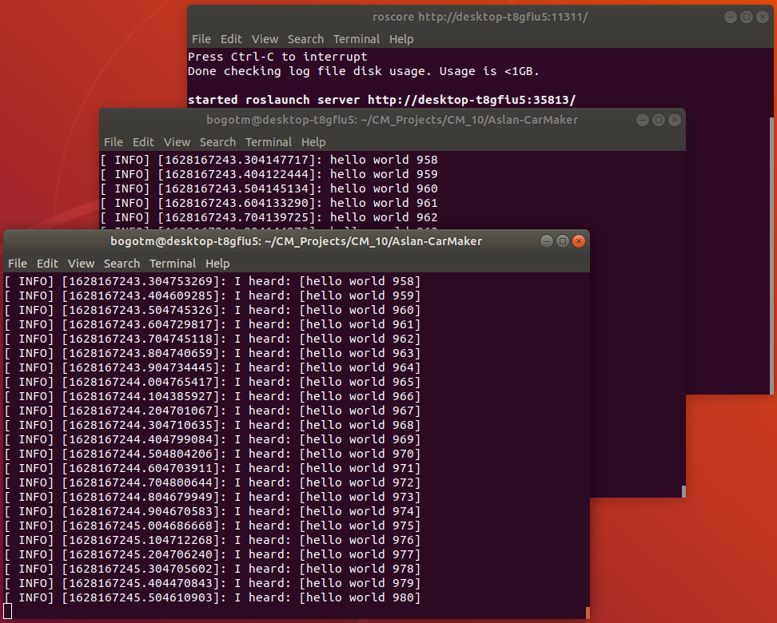
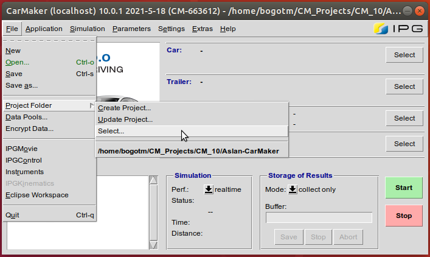
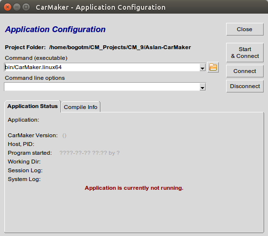
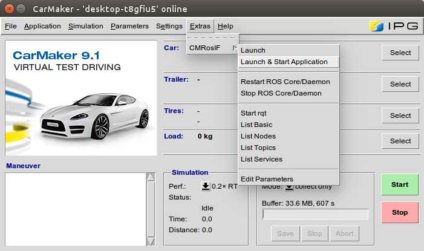
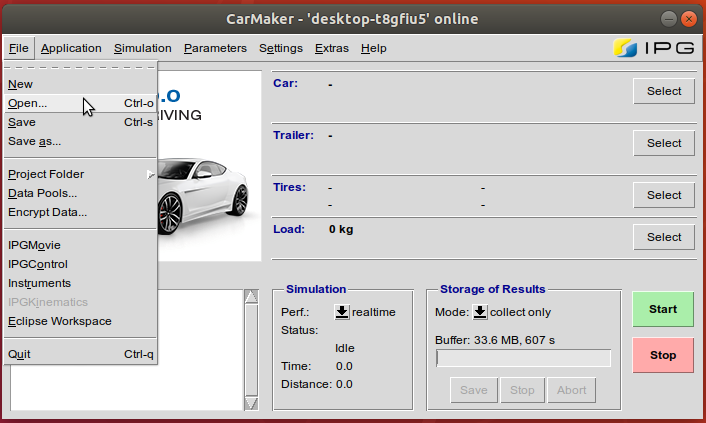
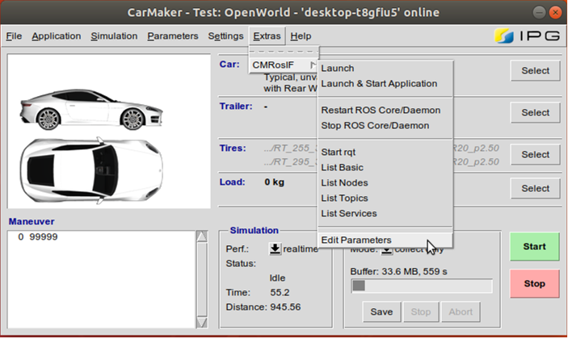
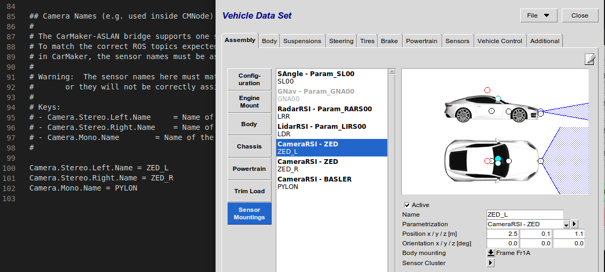

# Aslan-CarMaker

Integration of CarMaker with project [ASLAN](https://www.project-aslan.org/), open-source autonomous software for low-speed applications.

The project ASLAN code and documentation lives on the [ASLAN Github](https://github.com/project-aslan/Aslan/tree/melodic). The code is integrated into this project as a submodule.

## Requirements

### Supported

- CarMaker 10.1
- Ubuntu 18.04 LTS
- ROS 1 Melodic [ros-melodic-desktop-full](http://wiki.ros.org/melodic/Installation/Ubuntu)
- Catkin Command Line Tools [catkin_tools](https://catkin-tools.readthedocs.io/en/latest/installing.html)

## Installation

### ROS

- Follow the ROS installation instructions from step 2 in the [ASLAN setup documentation](https://github.com/project-aslan/Aslan/tree/melodic#2-install-ros-melodic-desktop-full)
- By default ROS installation is located in "/opt/ros/"
- Create symbolic link "/opt/ros/ros1" that points to your ROS distribution folder "/opt/ros/melodic"

```bash
cd /opt/ros
sudo ln -sfn melodic ros1
```

- Check ROS installation
  - roscore - execute this in a new terminal

    ```bash
    source /opt/ros/ros1/setup.bash
    roscore
    ```

  - Talker - execute this in a new terminal #2

    ```bash
    source /opt/ros/ros1/setup.bash
    rosrun roscpp_tutorials talker
    ```

  - Listener - execute this in a new terminal #3

    ```bash
    source /opt/ros/ros1/setup.bash
    rosrun roscpp_tutorials listener
    ```

  - Confirm that you can see the "hello world" messages being transmitted and received as seen below:

    <p align="center">
    
    </p>

### CarMaker

The CarMaker installation files can be found in the [IPG Client Area](https://ipg-automotive.com/support/client-area/installation-files/). The Client Area requires that the user have a registered account on the system, which should be straightforward to create.

Select the appropriate version of CarMaker that you want to install. Then expand the "Office" panel and download the Linux release of CarMaker, e.g. this project was built for CarMaker 10.1, so the corresponding archive would be `CD-CarMakerOffice-linux-10.1.zip`.

The archive constains the CarMaker installation files. Follow the installation instructions that can be found in the `InstallationGuide.pdf` inside the archive.

#### CarMaker Setup

The CarMaker installation attempts to automatically perform a number of steps required for standard CarMaker operation as well as for the functioning of this project. Unfortunately the installer has been known to fail silently on some of these steps. It is strongly suggested that the following checks are made if this is the first time any CarMaker version is being installed on a specific machine.

1. IPGHOME Environmental variable needs to point to the installation folder of CarMaker. Use the following command in bash to check if the variable is set:

    ```bash
    echo $IPGHOME
    ```

    If the command above returns the root directory of your CarMaker installation,nothing else needs to be done. If nothing is returned, however, then thevariable IPGHOME needs to be set manually. Use a text editor to edit the /etcenvironment file, e.g.:

    ```bash
    sudo -H gedit "/etc/environment"
    ```

    Add a new line at the end of the file and save it:

    ```bash
    IPGHOME="/opt/ipg"
    ```

    Note that "/opt/ipg" is the standard CarMaker installation location. If youchose a custom location, you need to use that in the command above.

2. LUSB library is required for CarMaker to run. This library should be installed the first time the ipg-installer runs on the local machine. Unfortunately this fails all to often. You can check whether you have the lusb library installed by running the following command in terminal:

    ```bash
    apt list libusb-dev
    ```

    If the command lists nothing, you can install the relevant package by typing:

    ```bash
    sudo apt-get install libusb-dev
    ```

    Alternatively, just use the second command and skip the checks. Nothing willhappen if you already have the library.

### Aslan-CarMaker Project

#### Project Directory Setup

The Aslan-CarMaker link is a complete CarMaker 10.1 project. IPG highly recommends that you have a separate dedicated directory for CarMaker projects with specific subdirectories for every major release of CarMaker. An example project structure in your Home directory would thus look like:

```bash
Home
└── CM_Projects     # Root of CarMaker projects
    ├── CM_7        # CarMaker 7 projects
    ├── CM_8        # CarMaker 8 projects
    ├── CM_9        # CarMaker 9 projects
    └── CM_10       # CarMaker 10 projects
```

#### Clone Project Repository

Open a terminal and go to the project folder where you would store your CarMaker 10 projects, e.g.:

```bash
cd ~/CM_Projects/CM_10
```

For convenience, Project Aslan is included as a submodule of this repository. To ensure that all project components are in the correct place where the build scripts expect them, clone the Aslan-CarMaker git along with its submodules:

```bash
git clone --branch main --recurse-submodules https://github.com/IPG-Automotive-UK/Aslan-CarMaker.git
```

#### Project Setup

The project includes a number of executable scripts that are used in the building and starting of the project. The appropriate permissions need to be given to all these script to allow them to run as executables. This only needs to be done once after cloning the project.

```bash
cd Aslan-CarMaker
chmod +x CMStart.sh
chmod +x build_cmrosif.sh
chmod +x ros/ros1_ws/build.sh
```

There are additional dependencies that project ASLAN requires that may need to be installed at this stage. This step also needs to be done only once after the project is cloned unless new dependencies are added in the future.

```bash
cd ros/Aslan
rosdep update
rosdep install -y --from-paths src --ignore-src --rosdistro melodic
cd ../..
```

#### Change CarMaker Version (optional)

To compile and use a different CarMaker 10 version other than 10.1, several changes to the code need to be made. These changes are described here and must be made before the project is built. All paths below are relative to the project root folder.

1. CMStart.sh - the command ```/opt/ipg/bin/CM-10.1``` (line 7) needs to point to the main CarMaker executable that you want to use. Alter the name and location of the executable as appropriate.
2. src/Makefile - the command ```include /opt/ipg/carmaker/linux64-10.1/include/MakeDefs.linux64``` (line 16) needs to point to the correct MakeDefs file for the desired CarMaker version. Alter the CarMaker source directory path as appropriate.
3. ros/ros1_ws/src/cmnode/CMakeLists.txt - The two strings that set the CarMaker version ```set(CARMAKER_VER 10.1)``` and ```set(CARMAKER_NUMVER 100100)``` (line 18-19) need to be appropriately altered to the CarMaker version of choice. The format for ```CARMAKER_NUMVER``` is ```<nDigitsMajor>.<2DigitsMinor>.<2DigitsBugfix>``` where the ```MAJOR.MINOR.BUGFIX``` is the actual CarMaker version.

#### Build Project

A build script `build_cmrosif.sh` is included in this project that must be run before use. It can be found in the top directory of the project. The build script can be executed from the terminal:

```bash
./build_cmrosif.sh
```

The script concurrently performs 3 build actions:

1. Build the ASLAN catkin workspace
2. Build the CarMaker ROS node workspace
3. Build the custom CarMaker executable for the project

Any modifications to the project source code or to the ASLAN source code require a rebuilding of the project.

## Usage

### Start CarMaker

To start CarMaker, use the custom script that is found in the root folder of this project.

```bash
./CMStart.sh
```

By using this script, you ensure that:

1. The appropriate ROS workspace files are sourced.
2. The CarMaker GUI starts with the additional dedicated ROS navigation menu.

### Start Project

CarMaker always starts by re-opening the project which was used in the previous session. The first time the user wants to start the Aslan-CarMaker work, they have to load the project manually. This is done through the `CM Main GUI > File > Project Folder > Select...` menu.

<p align="center">

</p>

The current Github repository is also the top level of a complete CarMaker project. Navigate to the folder that contains the local cloned copy and press OK. This is also the folder that contains the `CMStart.sh` start script that was just launched. Next time CarMaker is started, this step can be skipped as long as this project was the last loaded one in the previous session.

Once the CarMaker main GUI has started and the desired project is loaded, you must ensure that the project compiled executable is used instead of the default one. Go to `CM Main GUI > Application > Configuration/Status` and in the `Command (executable)` field select `bin/CarMaker.linux64`.

<p align="center">

</p>

This is the custom executable that is created for CarMaker during the build process. It contains not just the basic CarMaker binaries, but also the libraries needed to enable communication between CarMaker and ROS. If this step is not properly executed, any attempt to communicate from CarMaker over ROS would fail.

### Start Aslan

The Project Aslan startup process is accessible through the `CM Main GUI > Extras > CMRosIF > Launch` or `Extras > CMRosIF > Launch & Start Application` menu. The second option has the added step of connecting to the custom CarMaker executable once Project ASLAN has started.

<p align="center">

</p>

Please note that this step is added in the GUI only for convenience. If you would like greater control over how ASLAN starts, you can run the launch script from the terminal and add any flags or options that are appropriate:

```bash
./ros/Aslan/run
```

The command above assumes you are in the top level folder of the project.

Whether project ASLAN is started from the terminal or from the CarMaker GUI, using its start script is important and convenient as it also launches a `roscore` node. Thus the user does not need to worry about starting a master node manually.

### Select Testrun

A testrun defines a complete CarMaker simulation. It consists of the scenario (including traffic), the ego vehicle, as well as the maneuver that the vehicle will execute. For a new CarMaker user, it might be recommended to start with the example testrun that is included in the project. Open it through the `CM Main GUI > File > Open...` menu. The example testrun is called `OpenWorld`.

<p align="center">

</p>

The example includes all sensors and functionality that is supported by the project at any given point. Some of the sensors may be disabled, but they are defined and mounted on the vehicle.

## Status

### LiDAR RSI

The Aslan-CarMaker implementation can currently support at most one LiDAR RSI unit. Only the first LiDAR on the CarMaker vehicle is transmitted over ROS. Other units than the first one are ignored and should not be used at the moment as they would only slow down the simulation.

CarMaker has no user-friendly method to implement a rotating LiDAR at the moment. All sensors in CarMaker could be rotated and moved with explicit commands during the simulation. This can best be done in the underlying C code of the CarMaker ROS node implementation in the future. At the moment, a rotating LiDAR can also be effectively implemented by setting the sensor's field of view to 360°. We recommend this approach as the incoming data would be equivalent to a full cycle of a physical rotating LiDAR unit.

### RADAR RSI

The Aslan-CarMaker implementation can currently support at most one RADAR RSI unit. Only the first RADAR on the CarMaker vehicle is transmitted over ROS. Other units than the first one are ignored and should not be used at the moment as they would only slow down the simulation.

### Camera RSI

The Aslan-CarMaker implementation can currently support at most three Camera RSI sensors. Two of these sensors represent a left/right ZED stereo camera. The third sensor represents a single mono Basler Ace camera. Adding more than three cameras to the CarMaker test run will only slow down the simulation as the additional sensors will not be published on ROS.

Every camera added by the user needs to be assigned to a specific ASLAN-specific camera type. This has to be done in the CarMaker ROS interface additional parameters in the Extras menu.

<p align="center">

</p>

The ROS interface parameters are contained in an additional text file. A dedicated section inside describes how to assign a camera to a specific type by name. The names of the cameras assigned in the text file need to match exactly the names assigned to the cameras in the Assembly > Sensor Mountings section of the Vehicle Data Set parameters. A mismatch in names will lead to a camera not being published on ROS.

<p align="center">

</p>

The user is free to add any number of cameras up to three. It is even possible to add only half of the stereo camera and use it as a mono.

### Global Navigation System

A Global Navigation sensor in CarMaker can be used to simulate a physical GPS mounted on the ego vehicle. A few prerequisites need to be met to simulate a GPS system in CarMaker. They are described in detail in Section 20.14 of the CarMaker Reference Manual. In summary, the IPG Scenario that is currently running must have realistic set values for the latitude and longitude of the scenario origin. The actual date and time of the simulation need to be set in the Misc. section of the Environment parameters in CarMaker. For the chosen date of the simulation, the appropriate navigation message files must be downloaded from [NASA's archives](https://cddis.nasa.gov/Data_and_Derived_Products/GNSS/broadcast_ephemeris_data.html).

### Vehicle Control

A simplified translator is implemented that converts Aslan vehicle control requests to CarMaker vehicle control signals. Currently these translators are linear and bypass any complex non-linear steering, gas pedal, and brake pedal parameters from the CarMaker vehicle model. Aslan sends a normalised torque request and/or steering request to CarMaker which gets linearly mapped to brake pedal position, gas pedal position, and steering wheel angle.

### Documentation

This is the main documentation that describes the higher level functionality and state of the Aslan-CarMaker implementation. The backbone of this project on the CarMaker side is a publicly available project which implements a basic ROS node inside CarMaker and synchronises it with a simple external ROS node. The example project is available in the [FAQ section](https://ipg-automotive.com/support/client-area/faq/ticket/how-can-i-use-carmaker-with-ros/) of the IPG Client Area. The documentation of the original example can still be found in the `doc/` folder of this project. A lot of the information inside the documentation is not applicable to this specific project but users can still find it to be a really useful aid and source of knowledge. Specifically note that any work on node synchronisation based on a specific incoming message has been removed from the current implementation.
