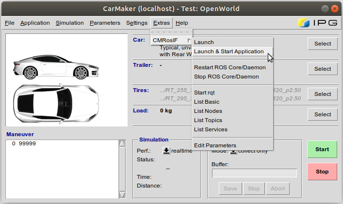

# Aslan-CarMaker
Integration of CarMaker with project ASLAN, open-source autonomous software for low-speed applications.

## Requirements
### Supported
- CarMaker 9.1
- Ubuntu 16.04 LTS
- ROS 1 Kinetic [ros-kinetic-desktop-full](http://wiki.ros.org/kinetic/Installation/Ubuntu)
- Catkin Command Line Tools [catkin_tools](https://catkin-tools.readthedocs.io/en/latest/installing.html)

### Prospective

- CarMaker 9.X.X
- Ubuntu 18.04 LTS
- ROS 1 Melodic [ros-melodic-desktop-full](http://wiki.ros.org/melodic/Installation/Ubuntu)

These have not been tested in the development process, but with slight modifications should work.

Any CarMaker 9 version can be used with slight modifications to the start and build scripts. These are documented below.

For ROS Melodic and Ubuntu 18.04, the [Melodic branch](https://github.com/project-aslan/Aslan/tree/melodic) of Project Aslan should be used instead of the master branch.


## Installation
### ROS
- Follow the installation instructions on http://wiki.ros.org/ROS/Installation
- By default ROS installation is located in "/opt/ros/"
- Create symbolic link "/opt/ros/ros1" that points to e.g. "/opt/ros/kinetic"
    - e.g. “cd /opt/ros; sudo ln -sfn kinetic ros1”
    - this is only to simplify usage of different ROS versions
    - otherwise you have to change paths with every ROS update (e.g. in scripts)
- Check ROS installation
    - roscore
        - Open a new terminal
        - source /opt/ros/ros1/setup.bash
        - roscore
    - Talker
        - Open a second terminal
        - source /opt/ros/ros1/setup.bash
        - rosrun roscpp_tutorials talker
    - Listener
        - Open a third terminal
        - source /opt/ros/ros1/setup.bash
        - rosrun roscpp_tutorials listener

### CarMaker
The CarMaker installation files can be found in the [IPG Client Area](https://ipg-automotive.com/support/client-area/installation-files/). The Client Area requires that the user have a registered account on the system, which should be straightforward to create.

Select the appropriate version of CarMaker that you want to install. Then expand the "Office" panel and download the Linux release of CarMaker, e.g. this project was built for CarMaker 9.1, so the corresponding archive would be `CD-CarMakerOffice-linux-9.1.zip`.

The archive constains the CarMaker installation files. Follow the installation instructions that can be found in the `InstallationGuide.pdf` inside the archive.

### Aslan-CarMaker
#### Project Directory Setup
The Aslan-CarMaker link is a complete CarMaker 9.1 project. IPG highly recommends that you have a separate dedicated directory for CarMaker projects with specific subdirectories for every major release of CarMaker. An example project structure in your Home directory would thus look like:

    Home
    └── CM_Projects     # Root of CarMaker projects
        ├── CM_7        # CarMaker 7 projects
        ├── CM_8        # CarMaker 8 projects
        └── CM_9        # CarMaker 9 projects

#### Clone Project Repository
Open a terminal and go to the project folder where you would store your CarMaker 9 projects, e.g.:

```
cd ~/CM_Projects/CM_9
```

For convenience, Project Aslan is included as a submodule of this repository. To ensure that all project components are in the correct place where the build scripts expect them, clone the Aslan-CarMaker git along with its submodules:

```
git clone --recurse-submodules https://github.com/IPG-Automotive-UK/Aslan-CarMaker.git
```

#### Build Project
A build script `build_cmrosif.sh` is included in this project that must be run before use. It can be found in the top directory of the project. Ensure that the appropriate permission has been given to the script to run as an executable.
```
cd Aslan-CarMaker
chmod +x build_cmrosif.sh
```

You only need to do this once, after which the script can be executed from the terminal:
```
./build_cmrosif.sh
```

The script concurrently performs 3 build actions:
1. Build the Aslan catkin workspace
2. Build the CarMaker ROS node workspace
3. Build the custom CarMaker executable for the project

## Usage
### Start CarMaker

To start CarMaker, use the custom script that is found in the root folder of this project. Before running it for the first time, set the script permissions to allow it to run as executable.
```
chmod +x CMStart.sh
```

You can now run the script which will start CarMaker:
```
./CMStart.sh
```

By using this script, you ensure that:
1. The appropriate ROS workspace files are sourced.
2. The CarMaker GUI starts with the additional dedicated ROS navigation menu.

Once the CarMaker main GUI has started, you must ensure that the project compiled executable is used instead of the default one. Go to "CM Main GUI -> Application -> Configuration / Status" and in the "Command (executable)" field select "bin/CarMaker.linux64".
<p align="center">

</p>

### Start Aslan

The Project Aslan startup process is accessible through the "CM Main GUI -> Extras -> CMRosIF -> Launch" or "CM Main GUI -> Extras -> CMRosIF -> Launch & Start Application" menu. The second option has the added step of connecting to the custom CarMaker executable once Project Aslan has started.

<p align="center">

</p>
