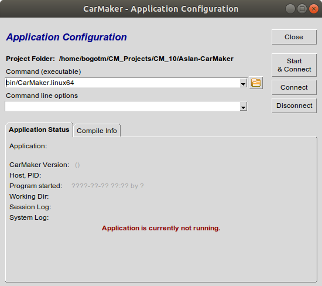

# Aslan-CarMaker

Integration of CarMaker with project ASLAN, open-source autonomous software for low-speed applications.

## Requirements

### Supported

- CarMaker 10.0
- Ubuntu 18.04 LTS
- ROS 1 Melodic [ros-melodic-desktop-full](http://wiki.ros.org/melodic/Installation/Ubuntu)
- Catkin Command Line Tools [catkin_tools](https://catkin-tools.readthedocs.io/en/latest/installing.html)

## Installation

### ROS

- Follow the installation instructions on the [ROS Wiki](http://wiki.ros.org/melodic/Installation/Ubuntu)
- By default ROS installation is located in "/opt/ros/"
- Create symbolic link "/opt/ros/ros1" that points to e.g. "/opt/ros/melodic"
  - e.g. “cd /opt/ros; sudo ln -sfn melodic ros1”
  - this is only to simplify usage of different ROS versions
  - otherwise you have to change paths with every ROS update (e.g. in scripts)
- Check ROS installation
  - roscore
    - Open a new terminal
    - type ```source /opt/ros/ros1/setup.bash```
    - type ```roscore```
  - Talker
    - Open a second terminal
    - type ```source /opt/ros/ros1/setup.bash```
    - type ```rosrun roscpp_tutorials talker```
  - Listener
    - Open a third terminal
    - type ```source /opt/ros/ros1/setup.bash```
    - type ```rosrun roscpp_tutorials listener```

### CarMaker

The CarMaker installation files can be found in the [IPG Client Area](https://ipg-automotive.com/support/client-area/installation-files/). The Client Area requires that the user have a registered account on the system, which should be straightforward to create.

Select the appropriate version of CarMaker that you want to install. Then expand the "Office" panel and download the Linux release of CarMaker, e.g. this project was built for CarMaker 10.0, so the corresponding archive would be `CD-CarMakerOffice-linux-10.0.zip`.

The archive constains the CarMaker installation files. Follow the installation instructions that can be found in the `InstallationGuide.pdf` inside the archive.

### Aslan-CarMaker Project

#### Project Directory Setup

The Aslan-CarMaker link is a complete CarMaker 10.0 project. IPG highly recommends that you have a separate dedicated directory for CarMaker projects with specific subdirectories for every major release of CarMaker. An example project structure in your Home directory would thus look like:

```bash
Home
└── CM_Projects     # Root of CarMaker projects
    ├── CM_7        # CarMaker 7 projects
    ├── CM_8        # CarMaker 8 projects
    ├── CM_9        # CarMaker 9 projects
    └── CM_10       # CarMaker 10 projects
```

#### Clone Project Repository

Open a terminal and go to the project folder where you would store your CarMaker 10 projects, e.g.:

```bash
cd ~/CM_Projects/CM_10
```

For convenience, Project Aslan is included as a submodule of this repository. To ensure that all project components are in the correct place where the build scripts expect them, clone the Aslan-CarMaker git along with its submodules:

```bash
git clone --branch melodic --recurse-submodules https://github.com/IPG-Automotive-UK/Aslan-CarMaker.git
```

#### Change CarMaker Version (optional)

To compile and use a different CarMaker 10 version other than 10.0, several changes to the code need to be made. These changes are described here and must be made before the project is built. All paths below are relative to the project root folder.

1. CMStart.sh - the command ```/opt/ipg/bin/CM-10.0``` (line 7) needs to point to the main CarMaker executable that you want to use. Alter the name and location of the executable as appropriate.
2. src/Makefile - the command ```include /opt/ipg/carmaker/linux64-10.0/include/MakeDefs.linux64``` (line 16) needs to point to the correct MakeDefs file for the desired CarMaker version. Alter the CarMaker source directory path as appropriate.
3. ros/ros1_ws/src/cmnode/CMakeLists.txt - The two strings that set the CarMaker version ```set(CARMAKER_VER 10.0)``` and ```set(CARMAKER_NUMVER 100000)``` (line 18-19) need to be appropriately altered to the CarMaker version of choice. The format for ```CARMAKER_NUMVER``` is ```<nDigitsMajor>.<2DigitsMinor>.<2DigitsPatch>``` where the ```MAJOR.MINOR.PATCH``` is the actual CarMaker version.

#### Build Project

A build script `build_cmrosif.sh` is included in this project that must be run before use. It can be found in the top directory of the project. Ensure that the appropriate permission has been given to the script to run as an executable, as well as the `ros/ros1_ws/build.sh` that builds the CarMaker node itself.

```bash
cd Aslan-CarMaker
chmod +x build_cmrosif.sh
chmod +x ros/ros1_ws/build.sh
```

You only need to do this once, after which the script can be executed from the terminal:

```bash
./build_cmrosif.sh
```

The script concurrently performs 3 build actions:

1. Build the Aslan catkin workspace
2. Build the CarMaker ROS node workspace
3. Build the custom CarMaker executable for the project

## Status

### LiDAR RSI

The Aslan-CarMaker implementation can currently support at most one LiDAR RSI unit. Only the first LiDAR on the CarMaker vehicle is transmitted to Aslan. Other units than the first one are ignored and should not be used at the moment as they would only slow down the simulation.

CarMaker has no user-friendly method to implement a rotating LiDAR at the moment. All sensors in CarMaker could be rotated and moved with explicit commands during the simulation. This can best be done in the underlying C code of the CarMaker ROS node implementation in the future. At the moment, a rotating LiDAR can also be effectively implemented by setting the sensor's field of view to 360°. We recommend this approach as the incoming data would be equivalent to a full cycle of a physical rotating LiDAR unit.

### RADAR RSI

The Aslan-CarMaker implementation can currently support at most one RADAR RSI unit. Only the first RADAR on the CarMaker vehicle is transmitted to Aslan. Other units than the first one are ignored and should not be used at the moment as they would only slow down the simulation.

### Global Navigation System

A Global Navigation sensor in CarMaker can be used to simulate a physical GPS mounted on the ego vehicle. A few prerequisites need to be met to simulate a GPS system in CarMaker. They are described in detail in Section 20.14 of the CarMaker Reference Manual. In summary, the IPG Scenario that is currently running must have realistic set values for the latitude and longitude of the scenario origin. The actual date and time of the simulation need to be set in the Misc. section of the Environment parameters in CarMaker. For the chosen date of the simulation, the appropriate navigation message files must be downloaded from [NASA's archives](https://cddis.nasa.gov/Data_and_Derived_Products/GNSS/broadcast_ephemeris_data.html).

### Vehicle Control

A simplified translator is implemented that converts Aslan vehicle control requests to CarMaker vehicle control signals. Currently these translators are linear and bypass any complex non-linear steering, gas pedal, and brake pedal parameters from the CarMaker vehicle model. Aslan sends a normalised torque request and/or steering request to CarMaker which gets linearly mapped to brake pedal position, gas pedal position, and steering wheel angle.

### Documentation

This is the main documentation that describes the higher level functionality and state of the Aslan-CarMaker implementation. The backbone of this project on the CarMaker side is a publicly available project which implements a basic ROS node inside CarMaker and synchronises it with a simple external ROS node. The example project is available in the [FAQ section](https://ipg-automotive.com/support/client-area/faq/ticket/how-can-i-use-carmaker-with-ros/) of the IPG Client Area. The documentation of the original example can still be found in the doc/ folder of this project. A lot of the information inside the documentation is not applicable to this specific project but users can still find it to be a really useful aid and source of knowledge. Specifically note that any work on node synchronisation based on a specific incoming message has been removed from the current implementation.

## Usage

### Start CarMaker

To start CarMaker, use the custom script that is found in the root folder of this project. Before running it for the first time, set the script permissions to allow it to run as executable.

```bash
chmod +x CMStart.sh
```

You can now run the script which will start CarMaker:

```bash
./CMStart.sh
```

By using this script, you ensure that:

1. The appropriate ROS workspace files are sourced.
2. The CarMaker GUI starts with the additional dedicated ROS navigation menu.

Once the CarMaker main GUI has started, you must ensure that the project compiled executable is used instead of the default one. Go to "CM Main GUI -> Application -> Configuration / Status" and in the "Command (executable)" field select "bin/CarMaker.linux64".

<p align="center">

</p>

### Start Aslan

The Project Aslan startup process is accessible through the "CM Main GUI -> Extras -> CMRosIF -> Launch" or "CM Main GUI -> Extras -> CMRosIF -> Launch & Start Application" menu. The second option has the added step of connecting to the custom CarMaker executable once Project Aslan has started.

<p align="center">

</p>
